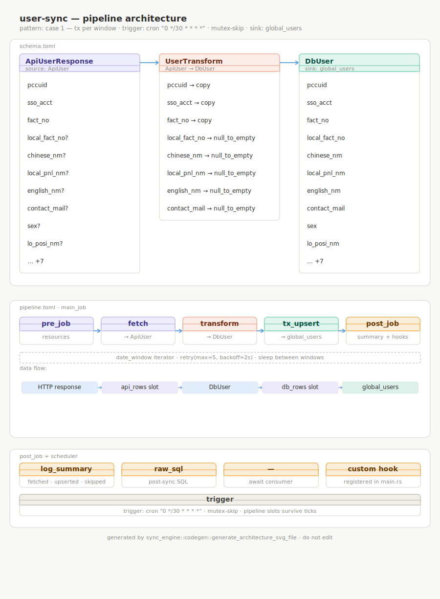

# user-sync — architecture

> Auto-generated by `build.rs`. Do not edit — regenerated on every build.

## Pattern: case 1 — tx per window

| Phase | Steps |
|-------|-------|
| pre\_job | build resources (postgres pool, oauth2, http client) · declare slots/queues |
| main\_job | date\_window iterator → retry → fetch → transform → tx_upsert |
| post\_job | log\_summary · raw\_sql · drain\_queue · custom hook |
| scheduler | cron `0 */30 * * * *` · mutex-skip · pipeline-scope slots survive ticks |

## Source records

| Source (`ApiUser`) | Transform rule | Sink (`DbUser`) |
|---|---|---|
| `pccuid` | `copy` | `pccuid` |
| `sso_acct` | `copy` | `sso_acct` |
| `fact_no` | `copy` | `fact_no` |
| `local_fact_no` | `null_to_empty` | `local_fact_no` |
| `chinese_nm` | `null_to_empty` | `chinese_nm` |
| `local_pnl_nm` | `null_to_empty` | `local_pnl_nm` |
| `english_nm` | `null_to_empty` | `english_nm` |
| `contact_mail` | `null_to_empty` | `contact_mail` |
